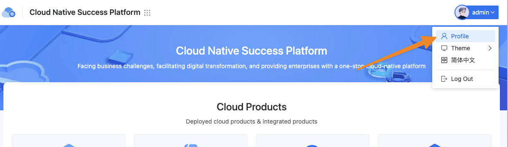
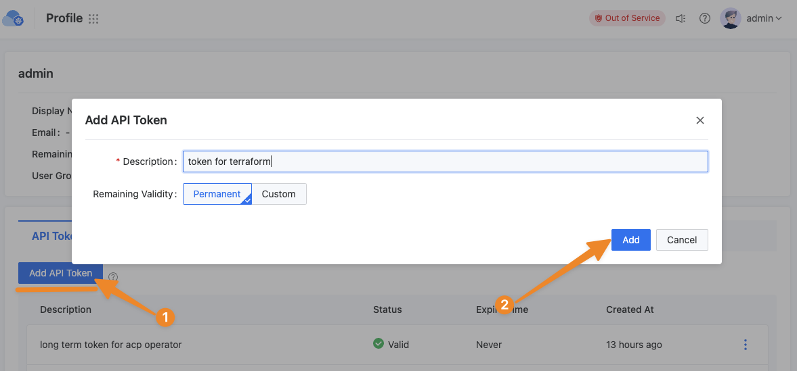

# Terraform and ACP Integration

The ACP (Alauda Container Platform) is a cloud platform product developed as an extension of Kubernetes. It exposes its resource management interfaces in the form of Kubernetes APIs. This architectural design allows ACP to seamlessly integrate with Kubernetes-related Providers in the Terraform ecosystem, enabling infrastructure-as-code management.

## Configuring the Provider

In your Terraform configuration file, you need to specify alekc/kubectl as the required provider. Here's an example configuration:

```hcl
terraform {
  required_providers {
    acp = {
      source  = "alekc/kubectl"
      version = "~> 2.0"
    }
  }
}
```

Since ACP is a multi-cluster management platform, we recommend using the method of defining a provider with multiple aliases to define the provider, with each alias corresponding to a cluster name. This method allows you to manage resources for multiple clusters in the same Terraform configuration and improve the readability and maintainability of the configuration.

```hcl
variable "acp_endpoint" {
  type string
}

variable "acp_token" {
  type string
}

provider acp {
  alias = "global"
  host = format("%s/kubernetes/global", trimsuffix(var.acp_endpoint, "/"))
  token = var.acp_token
  load_config_file = false
  insecure = false # if acp doesn't have a valid https certificate, set this to true
}
provider acp {
  alias = "cluster-1"
  host = format("%s/kubernetes/cluster-1", trimsuffix(var.acp_endpoint, "/"))
  token = var.acp_token
  load_config_file = false
  insecure = false # if acp doesn't have a valid https certificate, set this to true
}
```

The input parameters in the above example are explained as follows:    

- `alias`: Represents the alias for different clusters. It's recommended to keep this consistent with the cluster names in the ACP platform.
- `host`: The access address for the Kubernetes cluster. ACP provides a unified proxy for different business clusters. By using the ACP platform address with the `/kubernetes/<cluster-name>` path, you can proxy to the Kubernetes service of the corresponding business cluster. This method allows uniform access to different business clusters using the ACP user's token.
- `token`: The access token for the ACP platform. It can be obtained through the following steps:
    - Access the ACP platform and click the Profile button in the avatar to enter the user's details page
      
    - Click the Add API Token button, fill in the token description as prompted, then click the Add button to generate the token
      
    
- `load_config_file`: Determines whether to load the local `kubeconfig` configuration. We recommend setting this to `false` and using only the `host` and `token` method to configure the cluster.
- `insecure`: Set this parameter to `false` if your ACP environment has a valid HTTPS certificate. Otherwise, set it to `true`.